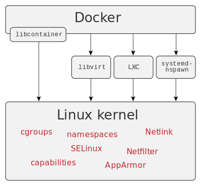

# Docker



**Quelle**: [Wikipedia: Docker](https://de.wikipedia.org/wiki/Docker_(Software))

---

# Docker

Docker dient zur Isolierung von Anwendungen mit Hilfe von sogenannter _Containervirtualisierung_. _Containervirtualisierung_ ist eine Methode um mehrere Instanzen eines Betriebssystems isoliert voneinander den Kernel eines Hostsystems nutzen zu lassen. Im Gegensatz zur Virtualisierung mittels eines Hypervisors hat _Containervirtualisierung_ zwar einige Einschränkungen, gilt aber als besonders ressourcenschonend.

**Quellen**
[Wikipedia: Docker](https://de.wikipedia.org/wiki/Docker_(Software))
[Wikipedia: Containervirtualisierung](https://de.wikipedia.org/wiki/Containervirtualisierung)

---

## Docker: Begrifflichkeiten

---

### Image
Ein Speicherabbild eines Containers. Das _Image_ selbst besteht aus mehreren _Layern_, die schreibgeschützt sind und somit nicht verändert werden können. Ein _Image_ ist portabel, kann in Repositories gespeichert und mit anderen Nutzern geteilt werden. Aus einem _Image_ können immer mehrere _Container_ gestartet werden.

**Quelle**
[Wikipedia: Docker](https://de.wikipedia.org/wiki/Docker_(Software))

---

### Container
Als _Container_ wird die aktive Instanz eines _Images_ bezeichnet. Der Container wird also gerade ausgeführt und ist beschäftigt. Sobald der _Container_ kein Programm ausführt oder mit seinem Auftrag fertig ist, wird der _Container_ automatisch beendet.

**Quelle**
[Wikipedia: Docker](https://de.wikipedia.org/wiki/Docker_(Software))

---

### Layer
Ein _Layer_ ist Teil eines _Images_ und enthält einen Befehl oder eine Datei, die dem _Image_ hinzugefügt wurde. Anhand der _Layer_ kann die ganze Historie des _Images_ nachvollzogen werden.

**Quelle**
[Wikipedia: Docker](https://de.wikipedia.org/wiki/Docker_(Software))

---

### Dockerfile
Eine Textdatei, die mit verschiedenen Befehlen ein _Image_ beschreibt. Diese werden bei der Ausführung abgearbeitet und für jeden Befehl ein einzelner _Layer_ angelegt.

**Quelle**
[Wikipedia: Docker](https://de.wikipedia.org/wiki/Docker_(Software))

---

# Fragen? Kurze Pause?

Als nächstes: **docker-compose**

---

# docker-compose
_docker-compose_ ist ein Werkzeug zur Definition und Ausführung von Multi-Container-Docker-Anwendungen. _docker-compose_ verwendet eine YAML-Datei, um die Dienste der Anwendung zu konfigurieren. Mit einem einzigen Befehl können anschließend alle Anwendungen gebaut und gestartet werden.

**Quelle**
[https://docs.docker.com/](https://docs.docker.com/compose/)

---

# docker-compose

Die Verwendung von _docker-compose_ ist ein dreistufiger Prozess:

 1. Definierung der Anwendung in einem _Dockerfile_
 2. Anschließend werden in der Datei `docker-compose.yml` die Dienste, aus denen die Applikation besteht (auch _Services_ genannt), definiert
 3. `docker-compose up` baut (sofern nötig) und startet alle definierten _Services_

**Quelle**
[https://docs.docker.com/](https://docs.docker.com/compose/)

---

### Minimaler Aufbau

```yml
version: "3.7"

services:
  php:
    image: php
```

---

### Image - Aufbau

Syntax: `image: <what>[:<version>[-<how>[-<kind>]]]`

---

### Image - Version
- `image: php`
- `image: php:latest` (gleichbedeutend mit `image: php` - `:latest` ist implizit)
- `image: php:8`
- `image: php:8.0`
- `image: php:7.1.33`

---

### Image - How & Kind (Tags)
- `image: php:7.1-fpm` (`<how>` ist hier `fpm`. Alternative wäre z.B. `apache` oder `cli`)
- `image: php:7.1-fpm-alpine` (`<kind>` ist `alpine`, ein **minimales** OS image. Alternative wären `buster` und `stretch`)

---

### Image - Other

- `image: ubuntu`
- `image: ubuntu:latest`
- `image: ubuntu:20.04`
- `image: Dgame/php-custom`

---

# Container - Name

```yml
version: "3.7"

services:
  php:
    image: php:8.1
```

Format: `<service-name>_<image-name>_<service-nummer>`
Hier also `php_php_1`

---

# Container - Name

```yml
version: "3.7"

services:
  php:
    container_name: php
    image: php:8.1
```

---

## Ports

### Short Syntax

 - Beide Ports angeben: `<Host>:<Container>`
 - Nur den Container Port angeben (ein freier Ports auf dem Host wird zufällig ausgewählt): `:<Container>`
 - Host-IP-Adresse und die Ports (default IP ist `0.0.0.0`): `<ip>:<Host>:<Container>`.

---
## Ports

**WICHTIG**: Ports immer als String angeben

> When mapping ports in the HOST:CONTAINER format, you may experience erroneous results when using a container port lower than 60, because YAML parses numbers in the format xx:yy as a base-60 value. For this reason, we recommend always explicitly specifying your port mappings as strings.

**Quelle**: [https://docs.docker.com/](https://docs.docker.com/compose/compose-file/compose-file-v3/#ports)

---

## Ports

### Short Syntax - Beispiele

```yml
ports:
  - "3000"
  - "3000-3005"
  - "8000:8000"
  - "9090-9091:8080-8081"
  - "49100:22"
  - "127.0.0.1:8001:8001"
  - "127.0.0.1:5000-5010:5000-5010"
  - "127.0.0.1::5000
  - "6060:6060/udp"
  - "12400-12500:1240"
```

---

## Ports

### Long Syntax

 - `target`: Container Port
 - `published`: Host Port
 - `protocol`: Port Protokol (`tcp` oder `udp`)
 - `mode`: _host_ für einen Host-Port oder _ingress_ für einen Port im Schwarmmodus für's Load-Balancing

```yml
ports:
  - target: 80
    published: 8080
    protocol: tcp
    mode: host
```

---

## Dependency

```yml
version: "3.7"

services:
  php:
    container_name: php
    image: php:8.0-fpm-alpine
    depends_on:
      - db
      - redis
  redis:
    image: redis
  db:
    image: postgres
```

---

## Dependency

 - `docker-compose up` startet die definierten Services in der Reihenfolge der Abhängigkeiten. Im Beispiel: `db` > `redis` > `php`
 - `docker-compose up <service>` schließt automatisch die Abhängigkeiten von `<service>` ein. Daher **startet** `docker-compose up php` auch `db` und `redis`.
 - `docker-compose stop` **stoppt** Services in der Reihenfolge der Abhängigkeiten. Daher wird `php` vor `db` und `redis` gestoppt.

**Quelle**
[https://docs.docker.com/](https://docs.docker.com/compose/)

---

## Restart

 - `restart: "no"`: Default. Container wird unter keinen Umständen neugestartet
 - `restart: always`: Wann immer der Container beendet wird (z.B. durch einen Fehler oder weile eine Verbindung abbricht)
 - `restart: on-failure`: Nur wenn der Container durch einen Fehler beendet wurde
 - `restart: unless-stopped`: Solange bis der Container erfolgreich beendet wird (z.B. manuell)

**Quelle**
[https://docs.docker.com/](https://docs.docker.com/compose/)

---

## Restart - Beispiel

```yml
version: "3.7"

services:
  php:
    container_name: php
    image: php:8.0-fpm-alpine
  db:
    image: postgres
    restart: always
```

---

## Volumes

Jeder Container geht bei jedem Start von der Image-Definition aus. Container können Dateien erstellen, aktualisieren und löschen, allerdings gehen diese Änderungen verloren, wenn der Container entfernt wird. Um das zu verhindern, benötigen wir _Volumes_.

Volumes bieten die Möglichkeit, bestimmte Dateisystempfade des Containers mit dem Host-Rechner zu verbinden. Wenn ein Verzeichnis im Container _gemountet_ wird, werden Änderungen in diesem Verzeichnis auch auf dem Host-Rechner gesynct.

**Quelle**
[https://docs.docker.com/](https://docs.docker.com/compose/)

---

## Volumes

Syntax:
```yml
  volumes:
    - <host>:<container>
```

---

## Volumes - Beispiel

```yml
version: "3.7"

services:
  php:
    container_name: php
    image: php:8.0-fpm-alpine
    volumes:
      - .:/var/www/html/
```

---

# Fragen? Kurze Pause?

Als nächstes: **Dockerfile**

---

# Dockerfile

 - `bash` zur Auto-Completion
 - `git` for obvious reasons wie composer
 - `shadow` um Benutzer zu verwalten (Docker startet alles als Root - BAD!)
 - `ssh` & `ssl`

---

## Dockerfile - docker-compose

```yml
version: "3.7"

services:
  php:
    container_name: php
    build:
      dockerfile: ./.docker/php/Dockerfile
      context: .
      args:
        USER_ID: $USER_ID
    volumes:
      - .:/var/www/html/:delegated
```

---

## Context

Durch den Verweist `dockerfile: ./.docker/php/Dockerfile` wird als _context_ `./.docker/php/` verwendet. Das heißt, dass das kopieren von Dateien von `./.docker/php/` ausgeht. Um einen anderen Ordner als Context zu verwenden, kann die Option `context <folder>` benutzt werden. Um z.B. im derzeitigen Ordner zu bleiben, wird `context: .` definiert.

---

## Dockerfile

```Dockerfile
FROM php:8.0-fpm-alpine

ARG USER_ID=1000

RUN apk update --quiet && \
    apk add --quiet --no-cache bash git shadow openssh openssl-dev

WORKDIR .
COPY . .

COPY --chown=www-data:www-data --from=composer:2 /usr/bin/composer /usr/local/bin/composer

RUN usermod -u $USER_ID www-data && chown -R www-data:www-data /var/www/ .
USER www-data

CMD ["php-fpm"]
```

---

## FROM

**Syntax**: `FROM <image> [AS <name>]`

 - `FROM php:8`
 - `FROM php:latest`
 - `FROM php:7.1`
 - `FROM php:8.0-fpm`
 - `FROM php:8.0-fpm-alpine`

---

## ARG

**Syntax**: `ARG <name>[=<default value>]`

 - `ARG USER_ID`
 - `ARG USER_ID=1000`

---

## RUN

**Syntax**: `RUN <command>`

```Dockerfile
RUN apk update --quiet && \
    apk add --quiet --no-cache bash git shadow openssh openssl-dev
```

---

## WORKDIR

**Syntax**: `WORKDIR <folder>`

`WORKDIR .`

---

## COPY

**Syntax**: `COPY <src> <dest>`

`COPY . .`

**WICHTIG**: Wenn `WORKDIR` spezifiziert ist, geht der Pfad im Container von diesem aus.

---

## COPY

Es ist auch möglich, von anderen _images_ etwas zu kopieren.

**Syntax**: `COPY [--chown=<user>:<group>] [--from=<image>] <src> <dest>`

`COPY --chown=www-data:www-data --from=composer:2 /usr/bin/composer /usr/local/bin/composer`

---

## USER

**Syntax**: `USER <user-on-os>`

`USER www-data`

---

## CMD

**Syntax**: `CMD [<cmd>, <arg1>, <arg2>, ...]`

**Achtung**: `[` ist hier **kein** Anzeichen für ein optionales Argument

 - `CMD ["php-fpm"]`
 - `CMD ["php", "-S", "0.0.0.0:9000"]`

**WICHTIG**: Bei letzterem ist der _Port_ **im** Container. Um diesen Port vom Host aus anzusprechen, muss im _docker-compose.yml_ ein entsprechendes Port-Mapping stattfinden.

---

# Good to know

---

## ENV

`ENV` kann verwendet werden, um die Umgebungsvariable _PATH_ zu aktualisieren.

**Syntax**: `ENV <name>=<value>`

---

## ENV - Beispiel

```Dockerfile
ENV PG_MAJOR=9.3
ENV PG_VERSION=9.3.4
RUN curl -SL https://example.com/postgres-${PG_VERSION}.tar.xz | tar -xJC /usr/src/postgres
ENV PATH=/usr/local/postgres-${PG_MAJOR}/bin:${PATH}
```
---

# Fragen? Kurze Pause?

Als nächstes: **Best practise** & **Multi-Staged**

---

# Best practise

Eine der größten Herausforderungen beim Erstellen von Images ist es, die Größe des Images gering zu halten. Jede Anweisung im Dockerfile fügt dem Image eine Schicht hinzu.

---

## Best practise - Nicht so gut

```Dockerfile
FROM golang:1.7.3
WORKDIR /go/src/github.com/alexellis/href-counter/
COPY app.go .
RUN go get -d -v golang.org/x/net/html
RUN CGO_ENABLED=0 GOOS=linux go build -a -installsuffix cgo -o app .
```

---

## Best practise - Nicht so gut

```Dockerfile
FROM golang:1.7.3
WORKDIR /go/src/github.com/alexellis/href-counter/
COPY app.go .
RUN go get -d -v golang.org/x/net/html
RUN CGO_ENABLED=0 GOOS=linux go build -a -installsuffix cgo -o app .
```

Zwei `RUN` - Zwei Layer

---

## Best practise - Besser

```Dockerfile
FROM golang:1.7.3
WORKDIR /go/src/github.com/alexellis/href-counter/
COPY app.go .
RUN go get -d -v golang.org/x/net/html \
    && CGO_ENABLED=0 GOOS=linux go build -a -installsuffix cgo -o app .
```

**Quelle**: [https://docs.docker.com/](https://docs.docker.com/develop/develop-images/multistage-build/)

---

# Multi-Staged

---

## Multi-Staged - Nicht so gut

```Dockerfile
FROM golang:1.7.3
WORKDIR /go/src/github.com/alexellis/href-counter/
RUN go get -d -v golang.org/x/net/html
COPY app.go .
CMD ["./app"]
```

---

## Multi-Staged - Besser

```Dockerfile
FROM golang:1.7.3 AS builder
WORKDIR /go/src/github.com/alexellis/href-counter/
RUN go get -d -v golang.org/x/net/html
COPY app.go .

FROM alpine:latest
WORKDIR /root/
COPY --from=builder /go/src/github.com/alexellis/href-counter/app .
CMD ["./app"]
```

**Quelle**: [https://docs.docker.com/](https://docs.docker.com/develop/develop-images/multistage-build/)

---

# Makefile

`make` ist ein build Tool um komplexe Befehle (und ggf. deren Abhängigkeiten) zusammenzufassen. Ein _Makefile_ besteht aus sogenannten _Targets_, optional Abhängigkeiten (separiert durch mind. einem Leerzeichen) und ausführbare Befehle. Letztere werden per Tab eingerückt unterhalb der _Targets_ und deren optionalen Abhängigkeiten. Ein Beispiel:

```Makefile
A: C B
	@echo "World"
B:
	@echo "my"
C:
	@echo "Hello"
```

Was kommt bei der Ausführung von `make A` raus?

---

# Makefile

Der Befehl `make A` würde im _Target_ `A` die Abhängigkeit zu `C` und `B` sehen und somit zunächst `C`, dann `B` und danach erst `A` ausführen. Die Ausgabe wäre:
```
Hello
my
World
```

---

# Makefile: Benennung

Um direkt per `make A` das _Target_ `A` auszuführen, muss die Datei `Makefile` heißen (so wie die Standard Datei für Docker `Dockerfile` heißt).

Wenn die Datei nicht `Makefile` heißt oder heißen soll/kann, dann muss die Datei auf die Endung `*.mk` enden und kann mit dem `-f` Argument eingelesen werden. Würde die Datei also z.B. `test.mk` heißen, würde das _Target_ `A` wie folgt ausgeführt werden: `make -f test.mk A`

---

# Makefile: Wozu?

Um z.B. per _docker-compose_ einen neuen Container von Grund auf zu bauen und ältere Artefakte loszuwerden, muss man den folgenden Befehl ausführen:

`docker-compose up -d --build --remove-orphans`

Das ist lang und umständlich. Stattdessen kann ein _Makefile_  verwendet werden mit dem folgenden Inhalt:

```Makefile
build:
	docker-compose up -d --build --remove-orphans
```

Was dann per `make build` ausgeführt werden kann.

---

# Makefile: Warum kein Shell-Script?

 - Shell Scripte sind nicht unbedingt kompatibel zwischen unterschiedlichen Shells (`sh`, `dash`, `bash`, `fish`, `zsh`, etc.)
 - Die Syntax ist komplexer
 - `make` ist auf jedem Linux-artigen Betriebssystem (und oft auch bei Windows) vorinstalliert

---

# Fragen? Kurze Pause?

Als nächstes: **Exkurs 1 - 3**
Danach: **Ende**

---

# Exkurs #1

Erstelle mit _docker_/_docker-compose_ einen PHP Service, der eine PHP Datei einliest mit dem folgenden Inhalt:

```php
<?php

phpinfo();
```
Als **PHP Version** soll **7.4** verwendet werden.
 - Unter http://localhost:8080 soll die _phpinfo_ ausgegeben werden.
 - Änderungen an der Datei auf dem Host sollen im Container ohne Neustart sichtbar sein (Stichwort _Volumes_).

**Tipp**: Verwende den builtin php Server (`php -S ...`)
**Zeit**: 30 - 60 Minuten

---

# Exkurs #2

Erweitere das Ergebnis aus _Exkurs #1_ insofern, dass anstatt des builtin php Servers _php-fpm_ verwendet wird.

**Zeit**: 2 Stunden

---

# Exkurs #3

Erstelle einen PHP sowie einen MySQL Service per _docker_/_docker-compose_.  Als **PHP Version** soll **7.4** verwendet werden.

 - Änderungen an der Datei auf dem Host sollen im Container ohne Neustart sichtbar sein (Stichwort _Volumes_)
 -  _composer_ steht als Befehl im Container zur Verfügung
 - Der PHP-Service soll bei jedem Aufruf einen neuen (random) Eintrag in eine Tabelle in der MySQL aufnehmen und die ersten 5 Ergebnisse ausgeben.

**Zeit**: 2 - 4 Stunden

---

# Fragen?