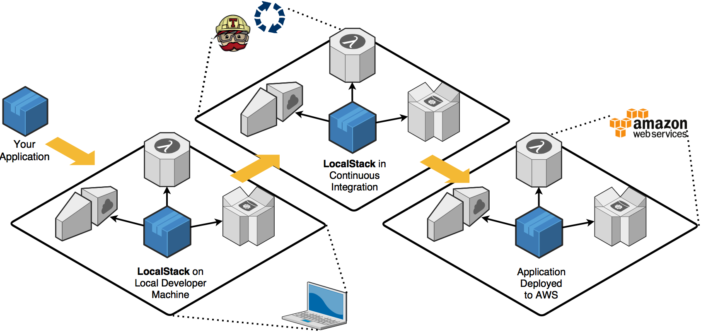

# Docker


**Quelle**: [Wikipedia: Docker](https://de.wikipedia.org/wiki/Docker_(Software))

---

# Docker

Docker dient zur Isolierung von Anwendungen mit Hilfe von sogenannter _Containervirtualisierung_. _Containervirtualisierung_ ist eine Methode um mehrere Instanzen eines Betriebssystems isoliert voneinander den Kernel eines Hostsystems nutzen zu lassen. Im Gegensatz zur Virtualisierung mittels eines Hypervisors hat _Containervirtualisierung_ zwar einige Einschränkungen, gilt aber als besonders ressourcenschonend.

**Quellen**
[Wikipedia: Docker](https://de.wikipedia.org/wiki/Docker_(Software))
[Wikipedia: Containervirtualisierung](https://de.wikipedia.org/wiki/Containervirtualisierung)

---

## Docker: Begrifflichkeiten

---

### Image
Ein Speicherabbild eines Containers. Das _Image_ selbst besteht aus mehreren _Layern_, die schreibgeschützt sind und somit nicht verändert werden können. Ein _Image_ ist portabel, kann in Repositories gespeichert und mit anderen Nutzern geteilt werden. Aus einem _Image_ können immer mehrere _Container_ gestartet werden.

**Quelle**
[Wikipedia: Docker](https://de.wikipedia.org/wiki/Docker_(Software))

---

### Container
Als _Container_ wird die aktive Instanz eines _Images_ bezeichnet. Der Container wird also gerade ausgeführt und ist beschäftigt. Sobald der _Container_ kein Programm ausführt oder mit seinem Auftrag fertig ist, wird der _Container_ automatisch beendet.

**Quelle**
[Wikipedia: Docker](https://de.wikipedia.org/wiki/Docker_(Software))

---

### Layer
Ein _Layer_ ist Teil eines _Images_ und enthält einen Befehl oder eine Datei, die dem _Image_ hinzugefügt wurde. Anhand der _Layer_ kann die ganze Historie des _Images_ nachvollzogen werden.

**Quelle**
[Wikipedia: Docker](https://de.wikipedia.org/wiki/Docker_(Software))

---

### Dockerfile
Eine Textdatei, die mit verschiedenen Befehlen ein _Image_ beschreibt. Diese werden bei der Ausführung abgearbeitet und für jeden Befehl ein einzelner _Layer_ angelegt.

**Quelle**
[Wikipedia: Docker](https://de.wikipedia.org/wiki/Docker_(Software))

---

# Fragen?

Als nächstes: **docker-compose**

---

# docker-compose
_docker-compose_ ist ein Werkzeug zur Definition und Ausführung von Multi-Container-Docker-Anwendungen. _docker-compose_ verwendet eine YAML-Datei, um die Dienste der Anwendung zu konfigurieren. Mit einem einzigen Befehl können anschließend alle Anwendungen gebaut und gestartet werden.

**Quelle**
[https://docs.docker.com/](https://docs.docker.com/compose/)

---

# docker-compose

Die Verwendung von _docker-compose_ ist ein dreistufiger Prozess:

 1. Definierung der Anwendung in einem _Dockerfile_
 2. Anschließend werden in der Datei `docker-compose.yml` die Dienste, aus denen die Applikation besteht (auch _Services_ genannt), definiert
 3. `docker-compose up` baut (sofern nötig) und startet alle definierten _Services_

**Quelle**
[https://docs.docker.com/](https://docs.docker.com/compose/)

---

### Minimaler Aufbau

```yml
version: "3.7"

services:
  php:
    image: php
```

---

### Image - Aufbau

Syntax: `image: <what>[:<version>[-<how>[-<kind>]]]`

---

### Image - Version
- `image: php`
- `image: php:latest` (gleichbedeutend mit `image: php` - `:latest` ist implizit)
- `image: php:8`
- `image: php:8.0`
- `image: php:7.1.33`

---

### Image - How & Kind (Tags)
- `image: php:7.1-fpm` (`<how>` ist hier `fpm`. Alternative wäre z.B. `apache` oder `cli`)
- `image: php:7.1-fpm-alpine` (`<kind>` ist `alpine`, ein **minimales** OS image. Alternative wären `buster` und `stretch`)

---

### Image - Other

- `image: ubuntu`
- `image: ubuntu:latest`
- `image: ubuntu:20.04`
- `image: Dgame/php-custom`

---

# Container - Name

```yml
version: "3.7"

services:
  php:
    image: php:8.1
```

Format: `<folder-name>_<service-name>_<service-index>`
Angenommen, dass `docker-compose.yml` im Ordner "test" liegt: `test_php_1`

---

# Container - Name

```yml
version: "3.7"

services:
  php:
    container_name: php
    image: php:8.1
```

---

## Ports

### Short Syntax

 - Beide Ports angeben: `<Host>:<Container>`
 - Nur den Container Port angeben (ein freier Ports auf dem Host wird zufällig ausgewählt): `:<Container>`
 - Host-IP-Adresse und die Ports (default IP ist `0.0.0.0`): `<ip>:<Host>:<Container>`.

---
## Ports

**WICHTIG**: Ports immer als String angeben

> When mapping ports in the HOST:CONTAINER format, you may experience erroneous results when using a container port lower than 60, because YAML parses numbers in the format xx:yy as a base-60 value. For this reason, we recommend always explicitly specifying your port mappings as strings.

**Quelle**: [https://docs.docker.com/](https://docs.docker.com/compose/compose-file/compose-file-v3/#ports)

---

## Ports

### Short Syntax - Beispiele

```yml
ports:
  - "3000"
  - "3000-3005"
  - "8000:8000"
  - "9090-9091:8080-8081"
  - "49100:22"
  - "127.0.0.1:8001:8001"
  - "127.0.0.1:5000-5010:5000-5010"
  - "127.0.0.1::5000
  - "6060:6060/udp"
  - "12400-12500:1240"
```

---

## Ports

### Long Syntax

 - `target`: Container Port
 - `published`: Host Port
 - `protocol`: Port Protokoll (`tcp` oder `udp`)
 - `mode`: _host_ für einen Host-Port oder _ingress_ für einen Port im Schwarmmodus für's Load-Balancing

```yml
ports:
  - target: 80
    published: 8080
    protocol: tcp
    mode: host
```

---

## Dependency

```yml
version: "3.7"

services:
  php:
    container_name: php
    image: php:8.0-fpm-alpine
    depends_on:
      - db
      - redis
  redis:
    image: redis
  db:
    image: postgres
```

---

## Dependency

 - `docker-compose up` startet die definierten Services in der Reihenfolge der Abhängigkeiten. Im Beispiel: `db` > `redis` > `php`
 - `docker-compose up <service>` schließt automatisch die Abhängigkeiten von `<service>` ein. Daher **startet** `docker-compose up php` auch `db` und `redis`.
 - `docker-compose stop` **stoppt** Services in der Reihenfolge der Abhängigkeiten. Daher wird `php` vor `db` und `redis` gestoppt.

**Quelle**
[https://docs.docker.com/](https://docs.docker.com/compose/)

---

## Restart

 - `restart: "no"`: Default. Container wird unter keinen Umständen neugestartet
 - `restart: always`: Wann immer der Container beendet wird (z.B. durch einen Fehler oder weil eine Verbindung abbricht)
 - `restart: on-failure`: Nur wenn der Container durch einen Fehler beendet wurde
 - `restart: unless-stopped`: Solange bis der Container erfolgreich beendet wird (z.B. manuell)

**Quelle**
[https://docs.docker.com/](https://docs.docker.com/compose/)

---

## Restart - Beispiel

```yml
version: "3.7"

services:
  php:
    container_name: php
    image: php:8.0-fpm-alpine
  db:
    image: postgres
    restart: always
```

---

## Volumes

Jeder Container geht bei jedem Start von der Image-Definition aus. Container können Dateien erstellen, aktualisieren und löschen, allerdings gehen diese Änderungen verloren, wenn der Container entfernt wird. Um das zu verhindern, benötigen wir _Volumes_.

Volumes bieten die Möglichkeit, bestimmte Dateisystempfade des Containers mit dem Host-Rechner zu verbinden. Wenn ein Verzeichnis im Container _gemountet_ wird, werden Änderungen in diesem Verzeichnis auch auf dem Host-Rechner gesynct.

**Quelle**
[https://docs.docker.com/](https://docs.docker.com/compose/)

---

## Volumes

Syntax:
```yml
  volumes:
    - <host>:<container>
```

---

## Volumes - Beispiel

```yml
version: "3.7"

services:
  php:
    container_name: php
    image: php:8.0-fpm-alpine
    volumes:
      - .:/var/www/html/
```

---

## Volumes: Options

```yml
volumes:
  - .:/var/www/html/[:<option>]
```

---

## Volumes: Options - consistent

 - `consistent` (_default_): Wenn sowohl Container als auch Host aktiv und kontinuierlich Änderungen an Daten vornehmen und es sowohl auf dem Host als auch im Container zeitgleich sichtbar sein soll.

Quelle: [Docker Volumes](http://docs.docker.oeynet.com/engine/admin/volumes/bind-mounts/)

---

## Volumes: Options - cached

 - `cached`: Wenn der Host Änderungen durchführt, befindet sich der Container im _Readyonly_-Modus. Es kann zu Verzögerungen kommen, bevor Aktualisierungen, die auf dem Host vorgenommen werden, innerhalb des Containers sichtbar sind. **Verwenden wenn**: der Host ständig Daten ändert, die der Container liest und verwendet.

```yml
volumes:
  - config/:/etc/var/www:cached
```

Quelle: [Docker Volumes](http://docs.docker.oeynet.com/engine/admin/volumes/bind-mounts/)

---

## Volumes: Options - delegated

 - `delegated`: Wenn der Docker-Container Änderungen durchführt, ist der Host im _Readyonly_-Modus. Es kann zu Verzögerungen kommen, bevor Aktualisierungen, die in einem Container vorgenommen werden, auf dem Host sichtbar sind.


```yml
volumes:
  - config/:/etc/var/www:delegated
```

Quelle: [Docker Volumes](http://docs.docker.oeynet.com/engine/admin/volumes/bind-mounts/)

---

## Volumes: Warum `delegated`?

>Mac uses osxfs to propagate directories and files shared from macOS to the Linux VM. This propagation makes these directories and files available to Docker containers running on Docker Desktop for Mac. **By default, these shares are fully-consistent, meaning that every time a write happens on the macOS host or through a mount in a container, the changes are flushed to disk so that all participants in the share have a fully-consistent view.

>Full consistency can severely impact performance in some cases.** Docker 17.05 and higher introduce options to tune the consistency setting on a per-mount, per-container basis.

Quelle: [Docker Volumes](http://docs.docker.oeynet.com/engine/admin/volumes/bind-mounts/)

---

## Volumes: Options - Read-Only

 - `ro`: Der Ordner / die Datei ist im Container nur lesend einsehbar

```yml
volumes:
  - .docker/config/php.ini:/etc/php/php.ini:ro
```

Quelle: [Docker Volumes](http://docs.docker.oeynet.com/engine/admin/volumes/bind-mounts/)

---

## Networks

```yml
version: "3.7"

services:
  php:
    container_name: php
    image: php:8.0-fpm-alpine
    volumes:
      - .:/var/www/html/
    networks:
      - backend

networks:
  backend:
    name: backend
    driver: bridge
```
---

## Networks - Wozu?

 - Services im selben `docker-compose.yml` sind implizit über dasselbe, interne Netzwerk verbunden (_default_)
 - Services aus anderen `docker-compose.yml` sind es nicht. Diese können aber, wenn sie im selben Netzwerk (= gleicher Name) sind, miteinander über dieses Netzwerk kommunizieren

---

## Networks - Driver

 - `bridge`: Default. Wird verwendet, wenn die verschiedenen Anwendungen in eigenständigen Containern laufen, die miteinander kommunizieren müssen.
 - `host`: Für eigenständige Containern. Die Netzwerkisolierung zwischen dem Container und dem Docker-Host wird aufgehoben. Stattdessen wird direkt das Netzwerk des Hosts verwendet.
 - `overlay`: I.d.R. nur für `docker-swarm` relevant
 - `macvlan`: Ermöglicht einem Container eine MAC-Adresse zuzuweisen, sodass dieser wie ein physisches Gerät im Netzwerk erscheint. Der Datenverkehr wird durch diese MAC-Adresse an die Container weitergeleitet.
 - `none`: Networks sind deaktiviert. (Achtung bei `docker-swarm`)

Quelle: [Docker Networks](https://docs.docker.com/compose/networking/)

---

## Networks - external

```yml
networks:
  frontend:
    name: frontend
    external: true
```

**vs**

```yml
networks:
  frontend:
    name: frontend
    driver: bridge
```

---

# Fragen? Kurze Pause?

Als nächstes: **Dockerfile**

---

# Dockerfile

Wir möchten die folgenden Pakete installieren:

 - `bash` zur Auto-Completion
 - `git` for obvious reasons
 - `shadow` um Benutzer zu verwalten (Docker startet alles als Root - BAD!)
 - `ssh` & `ssl`

---

## Dockerfile - docker-compose

```yml
version: "3.7"

services:
  php:
    container_name: php
    build:
      dockerfile: ./.docker/php/Dockerfile
      context: .
      args:
        USER_ID: $USER_ID
    volumes:
      - .:/var/www/html/
```

---

## Context

Durch den Verweis `dockerfile: ./.docker/php/Dockerfile` wird als _context_ `./.docker/php/` verwendet. Das heißt, dass das kopieren von Dateien von `./.docker/php/` ausgeht. Um einen anderen Ordner als Context zu verwenden, kann die Option `context <folder>` benutzt werden. Um z.B. im derzeitigen Ordner zu bleiben, wird `context: .` definiert.

---

## Dockerfile

```Dockerfile
FROM php:8.0-fpm-alpine

ARG USER_ID=1000

RUN apk update --quiet && \
    apk add --quiet --no-cache bash git shadow openssh openssl-dev

WORKDIR .
COPY . .

COPY --chown=www-data:www-data --from=composer:2 /usr/bin/composer /usr/local/bin/composer

RUN usermod -u $USER_ID www-data && chown -R www-data:www-data /var/www/ .
USER www-data

CMD ["php-fpm"]
```

---

## FROM

**Syntax**: `FROM <image> [AS <name>]`

 - `FROM php:8`
 - `FROM php:latest`
 - `FROM php:7.1`
 - `FROM php:8.0-fpm`
 - `FROM php:8.0-fpm-alpine`

---

## ARG

**Syntax**: `ARG <name>[=<default value>]`

 - `ARG USER_ID`
 - `ARG USER_ID=1000`

---

## RUN

**Syntax**: `RUN <command>`

```Dockerfile
RUN apk update --quiet && \
    apk add --quiet --no-cache bash git shadow openssh openssl-dev
```

---

## WORKDIR

**Syntax**: `WORKDIR <folder>`

`WORKDIR .`

---

## COPY

**Syntax**: `COPY <src> <dest>`

`COPY . .`

**WICHTIG**: Wenn `WORKDIR` spezifiziert ist, geht der Pfad im Container von diesem aus.

---

## COPY

Es ist auch möglich, von anderen _images_ etwas zu kopieren.

**Syntax**: `COPY [--chown=<user>:<group>] [--from=<image>] <src> <dest>`

`COPY --chown=www-data:www-data --from=composer:2 /usr/bin/composer /usr/local/bin/composer`

---

## USER

**Syntax**: `USER <user-on-os>`

`USER www-data`

---

## CMD

**Syntax**: `CMD [<cmd>, <arg1>, <arg2>, ...]`

**Achtung**: `[` ist hier **kein** Anzeichen für ein optionales Argument

 - `CMD ["php-fpm"]`
 - `CMD ["php", "-S", "0.0.0.0:9000"]`

**WICHTIG**: Bei letzterem ist der _Port_ **im** Container. Um diesen Port vom Host aus anzusprechen, muss im _docker-compose.yml_ ein entsprechendes Port-Mapping stattfinden.

---

# Good to know

---

## ENV

`ENV` kann verwendet werden, um die Umgebungsvariable _PATH_ zu aktualisieren.

**Syntax**: `ENV <name>=<value>`

---

## ENV - Beispiel

```Dockerfile
ENV PG_MAJOR=9.3
ENV PG_VERSION=9.3.4
RUN curl -SL https://example.com/postgres-${PG_VERSION}.tar.xz | tar -xJC /usr/src/postgres
ENV PATH=/usr/local/postgres-${PG_MAJOR}/bin:${PATH}
```
---

# Fragen? Kurze Pause?

Als nächstes: **Best practise** & **Multi-Staged**

---

# Best practise

Eine der größten Herausforderungen beim Erstellen von Images ist es, die Größe des Images gering zu halten. Jede Anweisung im Dockerfile fügt dem Image eine Schicht hinzu (die sogenannten _Layer_).

---

## Best practise - Nicht so gut

```Dockerfile
FROM golang:1.7.3
WORKDIR /go/src/github.com/alexellis/href-counter/
COPY app.go .
RUN go get -d -v golang.org/x/net/html
RUN CGO_ENABLED=0 GOOS=linux go build -a -installsuffix cgo -o app .
```

---

## Best practise - Nicht so gut

```Dockerfile
FROM golang:1.7.3
WORKDIR /go/src/github.com/alexellis/href-counter/
COPY app.go .
RUN go get -d -v golang.org/x/net/html
RUN CGO_ENABLED=0 GOOS=linux go build -a -installsuffix cgo -o app .
```

Zwei `RUN` - Zwei Layer

---

## Best practise - Besser

```Dockerfile
FROM golang:1.7.3
WORKDIR /go/src/github.com/alexellis/href-counter/
COPY app.go .
RUN go get -d -v golang.org/x/net/html \
    && CGO_ENABLED=0 GOOS=linux go build -a -installsuffix cgo -o app .
```

**Quelle**: [https://docs.docker.com/](https://docs.docker.com/develop/develop-images/multistage-build/)

---

# Multi-Staged

---

## Multi-Staged - Nicht so gut

```Dockerfile
FROM golang:1.7.3
WORKDIR /go/src/github.com/alexellis/href-counter/
RUN go get -d -v golang.org/x/net/html
COPY app.go .
CMD ["./app"]
```

---

## Multi-Staged - Besser

```Dockerfile
FROM golang:1.7.3 AS builder
WORKDIR /go/src/github.com/alexellis/href-counter/
RUN go get -d -v golang.org/x/net/html
COPY app.go .

FROM alpine:latest
WORKDIR /root/
COPY --from=builder /go/src/github.com/alexellis/href-counter/app .
CMD ["./app"]
```

**Quelle**: [https://docs.docker.com/](https://docs.docker.com/develop/develop-images/multistage-build/)

---

# Makefile

`make` ist ein build Tool um komplexe Befehle (und ggf. deren Abhängigkeiten) zusammenzufassen. Ein _Makefile_ besteht aus sogenannten _Targets_, optional Abhängigkeiten (separiert durch mind. einem Leerzeichen) und ausführbare Befehle. Letztere werden per Tab eingerückt unterhalb der _Targets_ und deren optionalen Abhängigkeiten. Ein Beispiel:

```Makefile
A: C B
	@echo "World"
B:
	@echo "my"
C:
	@echo "Hello"
```

Was kommt bei der Ausführung von `make A` raus?

---

# Makefile

Der Befehl `make A` würde im _Target_ `A` die Abhängigkeit zu `C` und `B` sehen und somit zunächst `C`, dann `B` und danach erst `A` ausführen. Die Ausgabe wäre:
```
Hello
my
World
```

---

# Makefile: Benennung

Um direkt per `make A` das _Target_ `A` auszuführen, muss die Datei `Makefile` heißen (so wie die Standard Datei für Docker `Dockerfile` heißt).

Wenn die Datei nicht `Makefile` heißt oder heißen soll/kann, dann muss die Datei auf die Endung `*.mk` enden und kann mit dem `-f` Argument eingelesen werden. Würde die Datei also z.B. `test.mk` heißen, würde das _Target_ `A` wie folgt ausgeführt werden: `make -f test.mk A`

---

# Makefile: Wozu?

Um z.B. per _docker-compose_ einen neuen Container von Grund auf zu bauen und ältere Artefakte loszuwerden, muss man den folgenden Befehl ausführen:

`docker-compose up -d --build --remove-orphans`

Das ist lang und umständlich. Stattdessen kann ein _Makefile_  verwendet werden mit dem folgenden Inhalt:

```Makefile
build:
	docker-compose up -d --build --remove-orphans
```

Was dann per `make build` ausgeführt werden kann.

---

# Makefile: Warum kein Shell-Script?

 - Shell Scripte sind nicht unbedingt kompatibel zwischen unterschiedlichen Shells (`sh`, `dash`, `bash`, `fish`, `zsh`, etc.)
 - Die Syntax ist komplexer
 - `make` ist auf jedem Linux-artigen Betriebssystem (und oft auch bei Windows) vorinstalliert

---

# Fragen? Kurze Pause?

Als nächstes: **Localstack**

---

# Localstack



---

# Localstack

> LocalStack provides an easy-to-use test/mocking framework for developing Cloud applications. It spins up a testing environment **on your local machine** that provides the same functionality and APIs as the real AWS cloud environment.
[...]
Your application is developed entirely on the local developer machines. LocalStack provisions all required "cloud" resources in a local container.
[...]
Once all tests are green, you flip the switch and the application can be seamlessly deployed to the real AWS cloud environment.

[Quelle](https://localstack.cloud/)

---

# Localstack

```yml
version: "3.7"

services:
  localstack:
    container_name: localstack_main
    image: localstack/localstack:latest
    ports:
      - 4566:4566"
    environment:
      - DEBUG=1
      - DATA_DIR=.localstack/data
      - SERVICES=es,firehose
    volumes:
      - ".localstack:/tmp/localstack"
      - "/var/run/docker.sock:/var/run/docker.sock"
```

---

# Localstack

 - `DEBUG` ⇒ `int` (1 ⇒ true, 0 ⇒ false)
  Um Fehler beim starten von Localstack oder deren Services besser zu identifizieren
 - `DATA_DIR` ⇒ `string`
  Lokales Verzeichnis zum Speichern persistenter Daten
 - `SERVICES` ⇒ `string`
  Komma-separierte Liste der AWS-Services, die gestartet werden sollen. Die Servicenamen entsprechen im Wesentlichen den Servicenamen der `aws-cli` (`kinesis`, `lambda`, `sqs`, `es`, etc.)

Quelle: [localstack](https://github.com/localstack/localstack)

---

# aws-cli installieren

>$ aws --version

>aws-cli/2...

---

# aws-cli installieren: Linux / WSL

 - `curl "https://awscli.amazonaws.com/awscli-exe-linux-x86_64.zip" -o "awscliv2.zip"`
 - `unzip awscliv2.zip`
 - `sudo ./aws/install`

---

# aws-cli installieren: Windows

 - https://docs.aws.amazon.com/cli/latest/userguide/install-cliv2-windows.html

---

# aws-cli installieren: Mac

 - https://docs.aws.amazon.com/cli/latest/userguide/install-cliv2-mac.html

---

# aws-cli ausführen

## Service ausführen:
> aws <service> <action> [options]

## Lokale Ausführung:
> aws **--endpoint-url=http://localhost:4566** <service> <action> [options]

---

# Localstack - Beispiel

[](https://mermaid-js.github.io/mermaid-live-editor/edit##eyJjb2RlIjoiZ3JhcGggTFJcbiAgQVtFeHRlcm5lIFN5c3RlbWVdLS0-fElucHV0fCBCW0FQSV1cbiAgQi0uLT5DMShGaXJlaG9zZSBTdHJlYW1zKSAmIEMyKEZpcmVob3NlIFN0cmVhbXMpICYgQzMoRmlyZWhvc2UgU3RyZWFtcylcbiAgQzEtLi0-RChFbGFzdGljc2VhcmNoIFNlcnZpY2UpXG4gIEMyLS4tPkRcbiAgQzMtLi0-RFxuXHRcdCIsIm1lcm1haWQiOiJ7XG4gIFwidGhlbWVcIjogXCJkZWZhdWx0XCJcbn0iLCJ1cGRhdGVFZGl0b3IiOmZhbHNlLCJhdXRvU3luYyI6dHJ1ZSwidXBkYXRlRGlhZ3JhbSI6ZmFsc2V9)

---

# Localstack - Beispiel

```sh
docker-compose -f localstack/docker-compose.yml up -d
```

---

# Localstack - Elasticsearch Service

> aws --endpoint-url=http://localhost:4566 es create-elasticsearch-domain --domain-name es_local

 - Service: `es`
 - Action: `create-elasticsearch-domain`
 - Options:
    - `--domain-name` ⇒ `es_local`

---

# Localstack - Elasticsearch Service

## Relevant für Production:
 - `--elasticsearch-version <value>`
 - `--elasticsearch-cluster-config <value>`

[aws-cli Dokumentation](https://docs.aws.amazon.com/cli/latest/reference/es/create-elasticsearch-domain.html)

---

# Localstack - Elasticsearch Service

 - 7.10, 7.9, 7.8, 7.7, 7.4, 7.1
 - 6.8, 6.7, 6.5, 6.4, 6.3, 6.2, 6.0
 - 5.6, 5.5, 5.3, 5.1
 - 2.3
 - 1.5

[Dokumentation](https://docs.aws.amazon.com/elasticsearch-service/latest/developerguide/what-is-amazon-elasticsearch-service.html#aes-choosing-version)

---

# Localstack - Elasticsearch Service

 - `InstanceType` ⇒ `m3.medium.elasticsearch`
 - `InstanceCount`
 - `DedicatedMasterEnabled`
 - `DedicatedMasterType` ⇒ `m3.large.elasticsearch`
 - `DedicatedMasterCount`

---

# Localstack - Elasticsearch Service

 - **Relevant** für Production &xhArr; **Irrelevant** für local(stack)

---

# Localstack - Elasticsearch Service

 - **Relevant** für Production &xhArr; **Irrelevant** für local(stack)
    - In `localstack` wird Elasticsearch Service durch ein **internes** Elasticsearch Cluster mit **einem Node** abgebildet
  ⇒ [Localstack - Externe Services](#localstack---externe-services)

---

# ARN

**A**mazon **R**esource **N**ames

## Format

- `arn:partition:service:region:account-id:resource-id`
- `arn:partition:service:region:account-id:resource-type/resource-id`
- `arn:partition:service:region:account-id:resource-type:resource-id`

[Dokumentation](https://docs.aws.amazon.com/general/latest/gr/aws-arns-and-namespaces.html)

---

# aws-cli: ARN

 - Response der `create-elasticsearch-domain` Action
 - `aws es describe-elasticsearch-domain ---domain-name es_local`

**Output**:
```json
{
  ...
  "ARN": arn:aws:es:us-east-1:000000000000:domain/es_local`,
  ...
}
```

---

# Fragen? Kurze Pause?

Als nächstes: **Localstack - Firehose**

---

# Localstack - Firehose

[](https://mermaid-js.github.io/mermaid-live-editor/edit##eyJjb2RlIjoiZ3JhcGggVERcbiAgQVtDaHJpc3RtYXNdIC0tPnxHZXQgbW9uZXl8IEIoR28gc2hvcHBpbmcpXG4gIEIgLS0-IEN7TGV0IG1lIHRoaW5rfVxuICBDIC0tPnxPbmV8IERbTGFwdG9wXVxuICBDIC0tPnxUd298IEVbaVBob25lXVxuICBDIC0tPnxUaHJlZXwgRltmYTpmYS1jYXIgQ2FyXVxuXHRcdCIsIm1lcm1haWQiOiJ7XG4gIFwidGhlbWVcIjogXCJkZWZhdWx0XCJcbn0iLCJ1cGRhdGVFZGl0b3IiOmZhbHNlLCJhdXRvU3luYyI6dHJ1ZSwidXBkYXRlRGlhZ3JhbSI6ZmFsc2V9)

---

# Localstack - Firehose: Create Stream

> aws --endpoint-url=http://localhost:4566 **firehose** ...

 - Service: `firehose`

---

# Localstack - Firehose: Create Stream

> aws --endpoint-url=http://localhost:4566 firehose **create-delivery-stream** ...

 - Service: `firehose`
 - Action: `create-delivery-stream`

---

# Localstack - Firehose: Create Stream

> aws --endpoint-url=http://localhost:4566 firehose create-delivery-stream **--delivery-stream-name firehose_es_local_stream** ...

 - Service: `firehose`
 - Action: `create-delivery-stream`
 - Options:
    - `--delivery-stream-name` ⇒ `firehose_es_local_stream`

---

# Localstack - Firehose: Create Stream

> aws --endpoint-url=http://localhost:4566 firehose create-delivery-stream --delivery-stream-name firehose_es_local_stream **--delivery-stream-type DirectPut** ...

 - Service: `firehose`
 - Action: `create-delivery-stream`
 - Options:
    - `--delivery-stream-name` ⇒ `firehose_es_local_stream`
    - `--delivery-stream-type` ⇒ `DirectPut`

---

# Localstack - Firehose: Create Stream

> aws --endpoint-url=http://localhost:4566 firehose create-delivery-stream --delivery-stream-name firehose_es_local_stream --delivery-stream-type DirectPut **--elasticsearch-destination-configuration "RoleARN=arn:aws:iam::000000000000:role/Firehose-Reader-Role,DomainARN=_<ARN>_,IndexName=test,ProcessingConfiguration={Enabled=false}"**

---

# Localstack - Firehose: Create Stream

 - `RoleARN` ⇒ `arn:aws:iam::000000000000:role/Firehose-Reader-Role`
 - `DomainARN` ⇒ z.B. für localstack `arn:aws:es:us-east-1:000000000000:domain/es_local`
    - Alternativ: `ClusterEndpoint` mit der **Host**-URL (mit Port)
 - `IndexName` ⇒ `test`
 - `ProcessingConfiguration`:
    - `Enabled` ⇒ `false`

---

# Localstack - Firehose: Put-Record

---

# Localstack - Firehose: Put-Record

> aws --endpoint-url=http://localhost:4566 **firehose** ...

 - Service: `firehose`

---

# Localstack - Firehose: Put-Record

> aws --endpoint-url=http://localhost:4566 firehose **put-record** ...

 - Service: `firehose`
 - Action: `put-record`

---

# Localstack - Firehose: Put-Record

> aws --endpoint-url=http://localhost:4566 firehose put-record **--delivery-stream-name firehose_es_local_stream** ...

 - Service: `firehose`
 - Action: `put-record`
 - Options:
    - `--delivery-stream-name` ⇒ `firehose_es_local_stream`

---

# Localstack - Firehose: Put-Record

> aws --endpoint-url=http://localhost:4566 firehose put-record --delivery-stream-name firehose_es_local_stream **--record '{"Data":"eyAidGFyZ2V0IjogImJlcnJ5IiB9"}**'

 - Service: `firehose`
 - Action: `put-record`
 - Options:
    - `--delivery-stream-name` ⇒ `firehose_es_local_stream`
    - `--record` ⇒ `{"Data":"eyAidGFyZ2V0IjogImJlcnJ5IiB9"}`
---

# Localstack - Firehose: Put-Record

```json
{ "Data": Blob }
```

**Blob**: `eyAidGFyZ2V0IjogImJlcnJ5IiB9`

```json
{ "target": "berry" }
```

_base64_ encoded

---

# Fragen? Kurze Pause?

Als nächstes: **Localstack - Externe Services**
Danach: **Ende**

---

# Localstack - Externe Services

---

# Localstack - Externe Services

 - `<SERVICE>_BACKEND`
 - `<SERVICE>_PORT`

---

# Localstack - Externe Services

`<SERVICE>` kann für einen der folgenden Services stehen:

 - `APIGATEWAY`
 - `CLOUDFORMATION`
 - `DYNAMODB`
 - `ELASTICSEARCH`
 - `KINESIS`
 - `S3`
 - `SNS`
 - `SQS`

---

# Localstack - Externe Services

- `Elasticsearch`: Docker
- `DynamoDB`
  - https://github.com/mhart/dynalite
  - https://hub.docker.com/r/amazon/dynamodb-local/
- `Kinesis`
  - https://github.com/mhart/kinesalite
- `SQS`
  - https://github.com/softwaremill/elasticmq

---

# Localstack - Externe Services: Elasticsearch

 - `ELASTICSEARCH_BACKEND`
 - `ELASTICSEARCH_PORT`

 ⇒ **innerhalb von Docker**

---

# Localstack - Externe Services: Elasticsearch

```yml
version: "3.7"

services:
  localstack:
    container_name: localstack_main
    image: localstack/localstack:latest
    ports:
      - 4566:4566"
    environment:
      - DEBUG=1
      - DATA_DIR=.localstack/data
      - SERVICES=es,firehose
      - ELASTICSEARCH_BACKEND=http://es_in_docker
      - ELASTICSEARCH_PORT=9200
    volumes:
      - ".localstack:/tmp/localstack"
      - "/var/run/docker.sock:/var/run/docker.sock"
```

---

# Localstack - Externe Services: Elasticsearch

> aws --endpoint-url=http://localhost:4566 es create-elasticsearch-domain --domain-name es_local

 ⇒ **immer noch nötig**, damit localstack sich mit dem externen Service verbindet!

---

# That's it Folks
## Fragen?

## Folien
 [Dgame/docker-tutorial](https://github.com/Dgame/docker-tutorial)